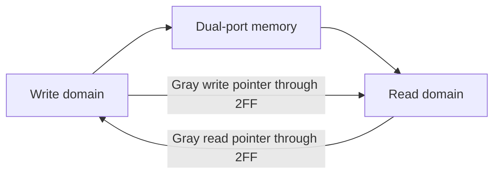

# Asynchronous FIFO — CDC RTL and Dual-Agent UVM Verification

A synthesizable dual-clock FIFO using Gray-coded pointers and two-flop synchronizers, verified with independent UVM write/read agents, a shared ordering scoreboard, SVA, coverage, and an executable Verilator smoke test.

## Architecture



Binary pointers stay in their owning domains. Only Gray pointers cross the CDC boundary. The next write pointer is compared with the synchronized read pointer with two upper Gray bits inverted to detect full; the next read pointer is compared with the synchronized write pointer to detect empty.

## UVM data flow

Two active agents run concurrently because writes and reads occur on unrelated clocks. Their monitors send only accepted operations to one queue-based scoreboard, which proves end-to-end ordering. Coverage crosses request activity with `full` and `empty`; SVA checks flag integrity and underflow blocking.

## Run

Cadence Xcelium/UVM:

```bash
make uvm
make regress
```

Portable RTL execution with Verilator 5.x:

```bash
make lint
make smoke
```

Successful smoke output ends with:

```text
ASYNC_FIFO_SMOKE_PASS checks=28
```

## What is verified

- Different write/read frequencies
- Full-depth fill and drain
- Overflow and underflow protection
- Concurrent reads and writes
- Multiple pointer wraparounds
- Data ordering across the clock boundary

See [the specification](docs/specification.md) and [verification plan](docs/verification_plan.md).

See also the [verified results and tool scope](docs/verification_results.md).

## Important CDC limitation

RTL simulation proves functional behavior but is not a substitute for structural CDC analysis and sign-off. A production flow should additionally run a CDC tool to verify synchronizer recognition, reset-domain assumptions, reconvergence, and Gray-pointer constraints.

## License

MIT — see [LICENSE](LICENSE).
